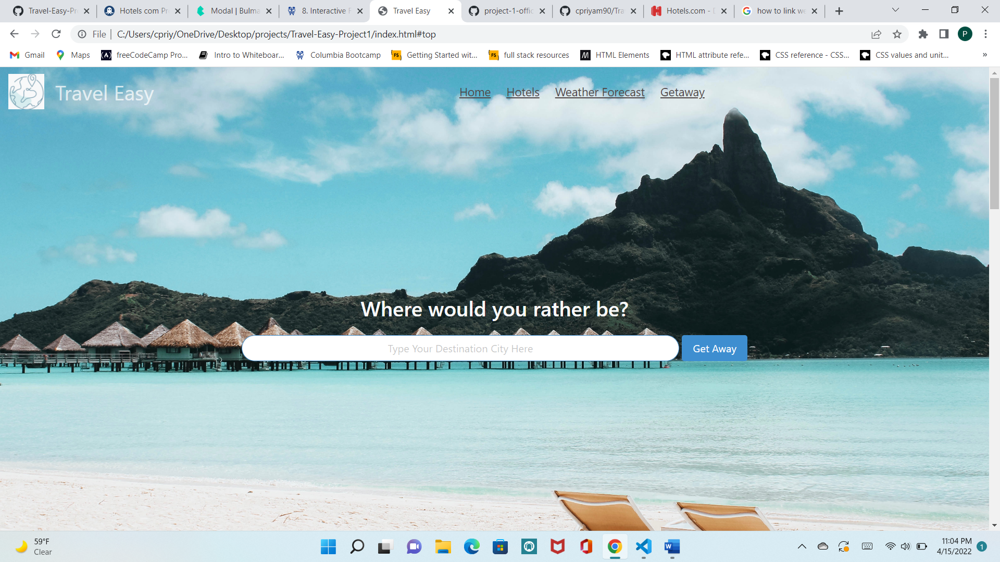
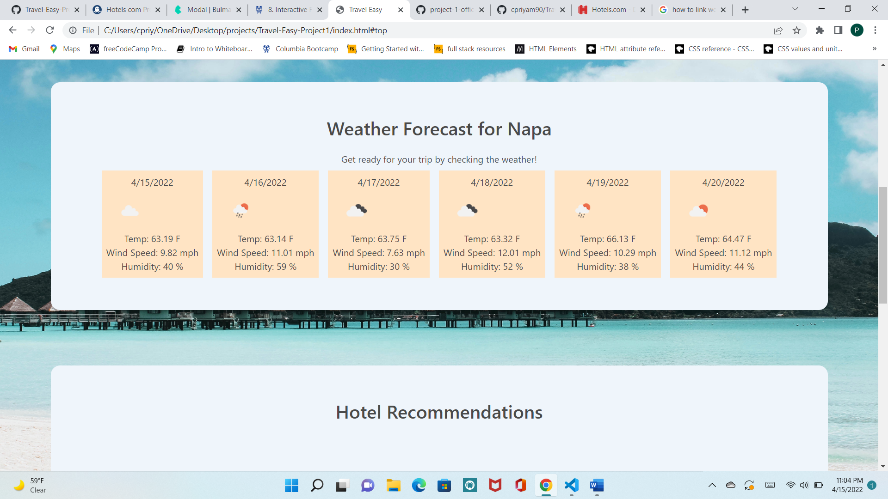
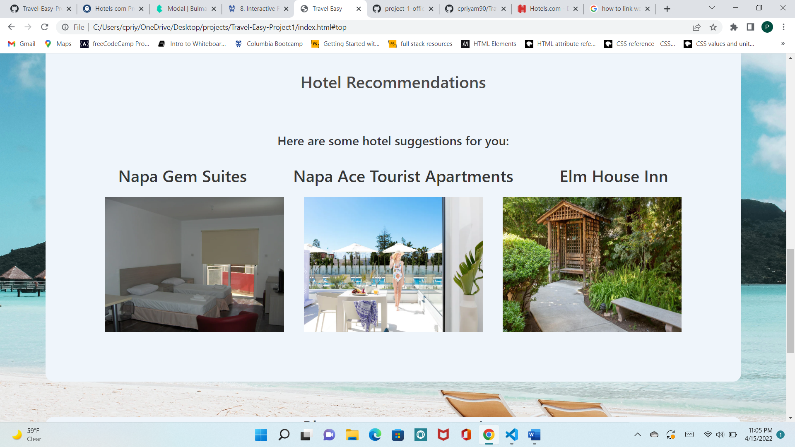
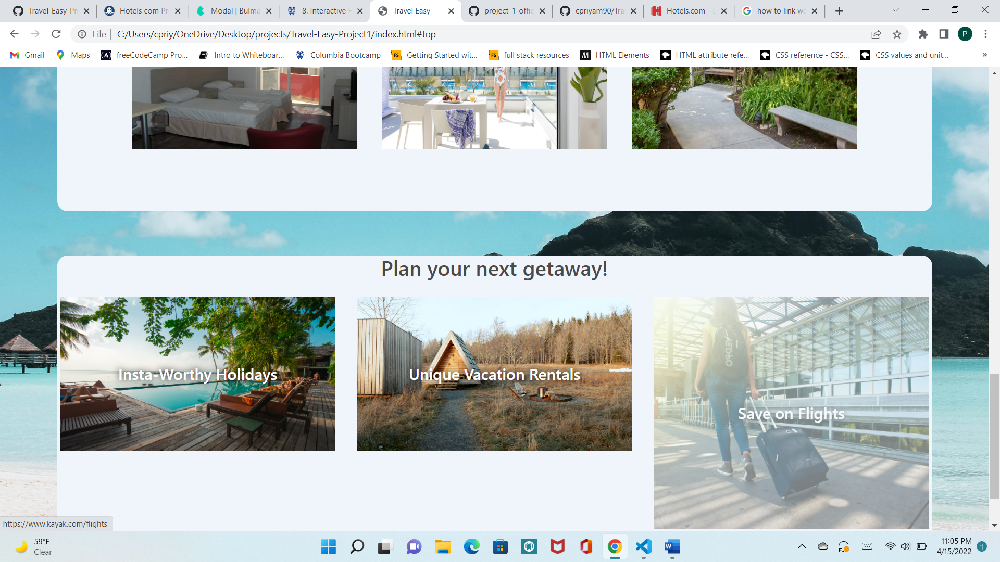

# Travel-Easy-Project1
## Link's and Demo

* ['TravelEasy - Github'](https://github.com/djpdim/TravelEasy-Project1)
* ['TravelEasy - Github IO'](https://djpdim.github.io/TravelEasy-Project1/)
* ['TravelEasy - Demo'](https://drive.google.com/file/d/1SJOld-dG0Uu8Wl3zUTRKrSY6BYI4vIMa/view)

## Description
"Feeling stuck at home? Need to get away from your computer screen for a weekend? We’re here to make Travel Easy. If you’re looking for spontaneity then we have the results for you. Find all of the cheapest hotel options and the weather forecasts by location and get on your way away."
\
\
Travel-Easy is a space where users can plan their vacations using our weather forecast and hotel finder search features. Travel had paused during the pandemic, but as restrictions reduce, people are looking to increase their travel. Travel-Easy allows them to plan for their last-minute travels by looking for the cheapest hotels in the area as well as packing appropriately by using our weather forecast feature.

## Technologies Used
* HTML
* CSS
* Bulma
* Jquery
* Moment.js
* JavaScript
* Hotels.com API
* OpenWeather API

## Process
In this group project we divided the tasks equally amongst all members. The first step was for us to get our wireframe ready, and after taking each team members' feedback, Nick created the HTML and included basic styling. Priyam added custom styling using CSS and Bulma, and Vickiana, Brittany, and Dimos worked on the JS code. While this was the overarching break-up of tasks, we all helped each other out and filled in the gaps as necessary. Priyam and Nick also contributed to the JS code when Brittany and Vickiana needed help, and Dimos contributed to the styling. Our team worked very well and was extremely communicative through all the hurdles.

## Successes
* Strong communication amongst team members
* Learning to work with git branches
* Understanding the nuances of Bulma and creating a clean and polished UI

## Challenges
* Github merge conflicts caused a bit of delay in our timeline, but eventually we overcame these issues with assistance from the TAs
* Limited free apis available for travel related searches
* Lack of detailed documentation with Hotels.com API

## User Story
* AS A traveler
* I WANT to book the best hotels based on my holiday style
* So THAT I can feel truly relaxed and rejuvenated

## Usage
When the user enters their destination of choice, and clicks on the "Get Away" button, the user is presented with a weather forecast for their destination. The user is also presented with a list of the best hotels in the area and an image to give the user an idea as to what their hotel will look like. Additonally, the user can plan a unique getaway by clicking on some additional links in the bottom such as booking vacation rentals and flights.

## Future Developments
* Adding a travel planner section where users can save their favorite cities
* Adding hotel booking feature to enable users to book hotels based on their travel dates
* Display reviews for hotel results
* Add flight api to enable user to find and book flights
* Adding an itinerary section where users can save searched itineraries which include hotels and flights

## Collaborators
* Nick Morihisa
* Priyam Chirawawala
* Vickiana Medina
* Dimos 
* Brittany Gahan

## Resources Used
* Bulma Documentation
* Hotels.com api
* OpenWeather api
* TAs and Tutors
* W3 schools

## Screenshot

* Screenshot of landing page

* Screenshot of when user enters city

* Screenshot of weather forecast

* Screenshot of hotel results

* Screenshot of additional travel links

